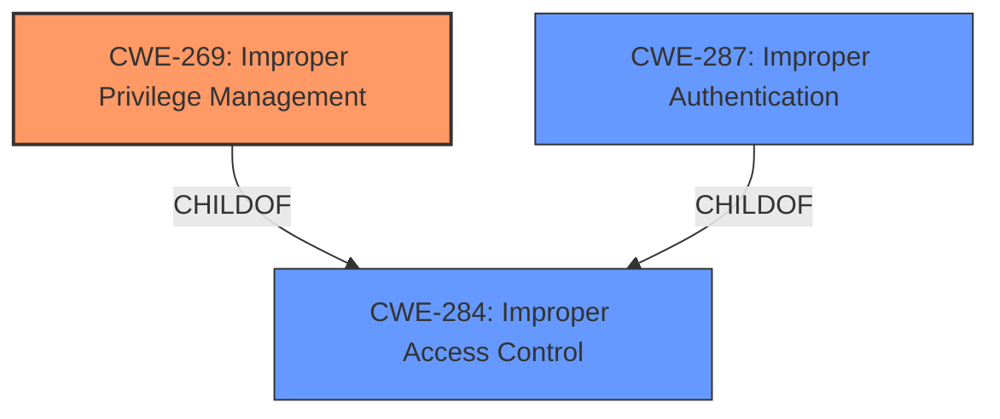

# Analysis Report for CVE-2024-0003

# Vulnerability Analysis Report: CVE-2024-0003

## Description

A condition exists in FlashArray Purity whereby a malicious user could use a remote administrative service to create an account on the array allowing privileged access.

## Vulnerability Description Key Phrases

- **Impact:** create account on array allowing privileged access
- **Attacker:** malicious user
- **Product:** FlashArray Purity
- **Component:** remote administrative service

## Analysis (with Relationship Data)

# Summary
| CWE ID | CWE Name | Confidence | CWE Abstraction Level | CWE Vulnerability Mapping Label | CWE-Vulnerability Mapping Notes |
|---|---|---|---|---|---|
| CWE-269 | Improper Privilege Management | 0.7 | Class | Primary | Allowed-with-Review |
| CWE-287 | Improper Authentication | 0.6 | Class | Secondary | Discouraged |

## Evidence and Confidence

*   **Confidence Score:** 0.7
*   **Evidence Strength:** MEDIUM

## Relationship Analysis
The primary relationship considered was that CWE-269 is a child of CWE-284, indicating a more specific type of protection mechanism failure. Since the vulnerability results in privileged access, CWE-269 was deemed more appropriate than its parent. However, the lack of detailed information about the exact authentication **weakness** makes the mapping less confident.



## Vulnerability Chain
The chain starts with a **weakness** in the remote administrative service. This **weakness** allows a malicious user to create an account with privileged access. The root cause appears to be an unspecified flaw related to privilege management.

## Summary of Analysis
The primary assessment is based on the vulnerability description, which states that a "malicious user could use a remote administrative service to create an account on the array allowing privileged access." This points to a **weakness** in how privileges are managed, making CWE-269 a reasonable fit.

The retriever results suggested several CWEs, including CWE-269, CWE-287, and CWE-306. CWE-306 (Missing Authentication) was considered, but the description mentions the *creation* of an account, implying that some form of authentication might be present but flawed, rather than entirely absent. CWE-287 (Improper Authentication) is a parent of CWE-306, and it is a more general case of an authentication **weakness**. It was considered as a secondary CWE since it could be a contributing factor.

CWE-269 was selected as the primary CWE because the direct impact is the gaining of privileged access, which aligns with the definition of improper privilege management.

Relevant CWE Information:

# Enhanced Context (25 CWEs)
The following CWEs were identified as potentially relevant to this vulnerability:

## CWE-73: External Control of File Name or Path
**Abstraction Level**: Base
**Similarity Score**: 0.82
**Source**: dense

**Description**:
The product allows user input to control or influence paths or file names that are used in filesystem operations.

**Mapping Guidance**:
- Usage: Allowed
- Rationale: This CWE entry is at the Base level of abstraction, which is a preferred level of abstraction for mapping to the root causes of vulnerabilities.

## CWE-269: Improper Privilege Management
**Abstraction:** Class
**Status:** Draft

### Description
The product does not properly assign, modify, track, or check privileges for an actor, creating an unintended sphere of control for that actor.

### Extended Description
Not provided

### Alternative Terms
None

### Relationships
ChildOf -> CWE-284

### Mapping Guidance
**Usage:** Discouraged
**Rationale:** CWE-269 is commonly misused. It can be conflated with "privilege escalation," which is a technical impact that is listed in many low-information vulnerability reports [REF-1287]. It is not useful for trend analysis.
**Comments:** If an error or mistake allows privilege escalation, then use the CWE ID for that mistake. Avoid using CWE-269 when only phrases such as "privilege escalation" or "gain privileges" are available, as these indicate technical impact of the vulnerability - not the root cause **weakness**. If the root cause seems to be directly related to privileges, then examine the children of CWE-269 for additional hints, such as Execution with Unnecessary Privileges (CWE-250) or Incorrect Privilege Assignment (CWE-266).
**Reasons:**
- Frequent Misuse

### Additional Notes
**[Maintenance]** The relationships between privileges, permissions, and actors (e.g. users and groups) need further refinement within the Research view. One complication is that these concepts apply to two different pillars, related to control of resources (CWE-664) and protection mechanism failures (CWE-693).

### Observed Examples
- **CVE-2001-1555:** Terminal privileges are not reset when a user logs out.
- **CVE-2001-1514:** Does not properly pass security context to child processes in certain cases, allows privilege escalation.
- **CVE-2001-0128:** Does not properly compute roles.

CWE-269 is the primary CWE because the vulnerability description explicitly mentions the creation of an account with "privileged access." This directly aligns with the concept of improper privilege management. While the mapping guidance discourages using CWE-269 if only phrases like "privilege escalation" are available, the specific context of account creation supports its selection.

CWE-287 is considered as a contributing factor because the vulnerability involves the creation of an account via a remote administrative service, implying a potential **weakness** in the authentication process. However, without further details, it's difficult to pinpoint the exact authentication failure.

The final decision is based on the available evidence, relationship analysis, and consideration of mapping guidance. CWE-269 is at the optimal level of specificity given the provided information.


## CWE Relationship Analysis

Current CWEs represent these abstraction levels: .


### Vulnerability Chain Analysis

**Chain starting from CWE-287:**
- 287 (Improper Authentication) - ROOT


**Chain starting from CWE-266:**
- 266 (Incorrect Privilege Assignment) - ROOT


### CWE Relationship Diagram

```mermaid
graph TD
    classDef primary fill:#f96,stroke:#333,stroke-width:2px
    classDef secondary fill:#69f,stroke:#333
    classDef tertiary fill:#9e9,stroke:#333
```


*Report generated on 2025-07-10 11:13:34*
