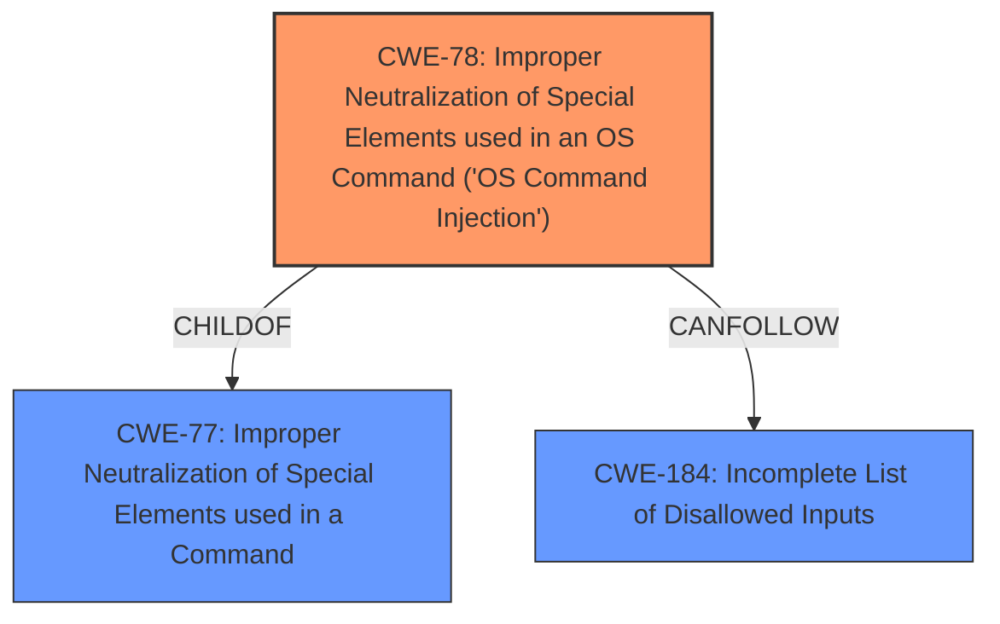

# Analysis Report for CVE-2024-0005

# Vulnerability Analysis Report: CVE-2024-0005

## Description

A condition exists in FlashArray and FlashBlade Purity whereby a malicious user could execute arbitrary commands remotely through a specifically crafted SNMP configuration.

## Vulnerability Description Key Phrases

- **Impact:** execute arbitrary commands remotely
- **Vector:** specifically crafted SNMP configuration
- **Attacker:** malicious user
- **Product:** FlashArray and FlashBlade Purity

## Analysis (with Relationship Data)

# Summary
| CWE ID | CWE Name | Confidence | CWE Abstraction Level | CWE Vulnerability Mapping Label | CWE-Vulnerability Mapping Notes |
|---|---|---|---|---|---|
| CWE-78 | Improper Neutralization of Special Elements used in an OS Command ('OS Command Injection') | 0.9 | Base | Primary | Allowed |

## Evidence and Confidence

*   **Confidence Score:** 0.9
*   **Evidence Strength:** HIGH

## Relationship Analysis
The primary CWE is CWE-78. It has a parent CWE of CWE-77 which is "Improper Neutralization of Special Elements used in a Command". It also has a CANFOLLOW relationship to CWE-184 "Incomplete List of Disallowed Inputs". This indicates that a potential chain could involve an incomplete list of disallowed inputs leading to OS command injection. The abstraction level of Base for CWE-78 is appropriate as it provides a specific root cause for the vulnerability.mermaid



## Vulnerability Chain
The vulnerability chain starts with a specifically crafted SNMP configuration that is **improperly neutralized**, leading to the ability to execute arbitrary commands remotely.
  - Root Cause: **Improper Neutralization** (CWE-78)
  - Impact: Remote command execution

## Summary of Analysis
The analysis is strongly based on the provided evidence, particularly the vulnerability description and the CVE Reference Links Content Summary, which explicitly states that a malicious user could execute arbitrary commands remotely through a specifically crafted SNMP configuration. The root cause is the **improper neutralization** of special elements within the SNMP configuration, leading to OS command injection.

The graph relationships further support this selection, with CWE-78 being a base-level CWE and having relationships to other relevant CWEs like CWE-77 (Improper Neutralization of Special Elements used in a Command) and CWE-184 (Incomplete List of Disallowed Inputs).

CWE-78 is selected because it directly addresses the root cause of the vulnerability: the **improper neutralization** of special elements that allows for OS command injection. This is at the optimal level of specificity, as it clearly defines the type of weakness and the resulting impact.

Relevant CWE Information:

# Enhanced Context (25 CWEs)
The following CWEs were identified as potentially relevant to this vulnerability:

## CWE-78: Improper Neutralization of Special Elements used in an OS Command ('OS Command Injection')
**Abstraction Level**: Base
**Similarity Score**: 5.03
**Source**: graph

**Description**:
The product constructs all or part of an OS command using externally-influenced input from an upstream component, but it **does not neutralize or incorrectly neutralizes special elements** that could modify the intended OS command when it is sent to a downstream component.

**Mapping Guidance**:
- Usage: Allowed
- Rationale: This CWE entry is at the Base level of abstraction, which is a preferred level of abstraction for mapping to the root causes of vulnerabilities.

**Relationships**:
- CANFOLLOW -> CWE-184
- CANALSOBE -> CWE-88
- CHILDOF -> CWE-77
- CHILDOF -> CWE-77
- CHILDOF -> CWE-74

## CWE-78: Improper Neutralization of Special Elements used in an OS Command ('OS Command Injection')

This CWE is the most fitting due to the ability to "execute arbitrary commands remotely".

CWEs considered but not used:

*   CWE-89: Improper Neutralization of Special Elements used in an SQL Command ('SQL Injection') - This CWE relates to SQL injection, which is not relevant to the vulnerability description.
*   CWE-138: Improper Neutralization of Special Elements - This is a class-level CWE and less specific than CWE-78.
*   CWE-269: Improper Privilege Management - While privilege management may be a factor, the root cause is the improper neutralization of special elements.
*   CWE-427: Uncontrolled Search Path Element - This CWE is not directly related to the vulnerability description.
*   CWE-502: Deserialization of Untrusted Data - This CWE is not directly related to the vulnerability description.
*   CWE-73: External Control of File Name or Path - This CWE is not directly related to the vulnerability description.
*   CWE-20: Improper Input Validation - This is a class-level CWE and less specific than CWE-78.
*   CWE-912: Hidden Functionality - This CWE is not directly related to the vulnerability description.
*   CWE-184: Incomplete List of Disallowed Inputs - This could be a secondary weakness, but the primary issue is the lack of proper neutralization.
```


## CWE Relationship Analysis

Current CWEs represent these abstraction levels: .


### Vulnerability Chain Analysis

**Chain starting from CWE-184:**
- 184 (Incomplete List of Disallowed Inputs) - ROOT


**Chain starting from CWE-138:**
- 138 (Improper Neutralization of Special Elements) - ROOT


### CWE Relationship Diagram

```mermaid
graph TD
    classDef primary fill:#f96,stroke:#333,stroke-width:2px
    classDef secondary fill:#69f,stroke:#333
    classDef tertiary fill:#9e9,stroke:#333
```


*Report generated on 2025-07-10 11:13:58*
