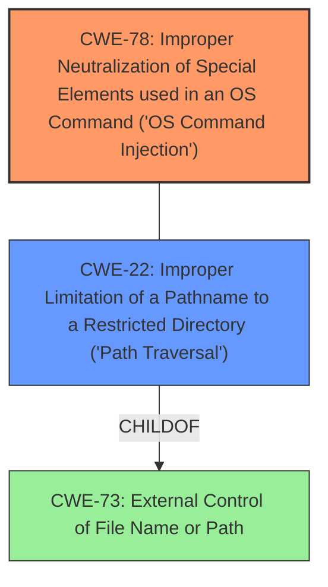

# Analysis for CVE-2024-10019

# Summary
| CWE ID | CWE Name | Confidence | CWE Abstraction Level | CWE Vulnerability Mapping Label | CWE-Vulnerability Mapping Notes |
|---|---|---|---|---|---|
| CWE-78 | Improper Neutralization of Special Elements used in an OS Command ('OS Command Injection') | 1.0 | Base | Allowed | Primary CWE: The vulnerability allows execution of arbitrary OS commands due to insufficient sanitization. |
| CWE-22 | Improper Limitation of a Pathname to a Restricted Directory ('Path Traversal') | 0.9 | Base | Allowed | Secondary CWE: Path traversal allows uploading a malicious file to an arbitrary location. |

## Evidence and Confidence

*   **Confidence Score:** 0.95
*   **Evidence Strength:** HIGH

## Relationship Analysis
The primary weakness is **CWE-78** [CWE-78: Improper Neutralization of Special Elements used in an OS Command ('OS Command Injection')], which results from the application's failure to sanitize input before using it in an OS command. This is directly caused by **CWE-22** [CWE-22: Improper Limitation of a Pathname to a Restricted Directory ('Path Traversal')], which allows an attacker to upload a malicious file to an arbitrary location.

## Vulnerability Chain
1.  The application **fails to properly sanitize** the `app_name` parameter (**ROOTCAUSE**).
2.  This leads to a **path traversal vulnerability** (**CWE-22** [CWE-22: Improper Limitation of a Pathname to a Restricted Directory ('Path Traversal')]), allowing an attacker to upload a malicious `server.py` file to an arbitrary location.
3.  The application then executes this file, resulting in **OS command injection** (**CWE-78** [CWE-78: Improper Neutralization of Special Elements used in an OS Command ('OS Command Injection')]), allowing the attacker to execute arbitrary code (**IMPACT**).

## Summary of Analysis
The vulnerability is a combination of path traversal and OS command injection due to **improper sanitization** of the `app_name` parameter. The primary weakness is **CWE-78** [CWE-78: Improper Neutralization of Special Elements used in an OS Command ('OS Command Injection')] because the ultimate goal of the attacker is to execute arbitrary commands on the system. However, this is only possible because of the path traversal vulnerability **CWE-22** [CWE-22: Improper Limitation of a Pathname to a Restricted Directory ('Path Traversal')], which allows the attacker to place the malicious file in a location where it can be executed.

The vulnerability description clearly states: "A vulnerability in the `start_app_server` function of parisneo/lollms-webui V12 (Strawberry) allows for path traversal and **OS command injection**. The function **does not properly sanitize** the `app_name` parameter, enabling an attacker to upload a malicious `server.py` file and execute arbitrary code by exploiting the **path traversal vulnerability**."

**CWE-78** [CWE-78: Improper Neutralization of Special Elements used in an OS Command ('OS Command Injection')] is selected as the primary CWE because the attacker's goal is to execute arbitrary commands, which is the direct consequence of **improper sanitization**. **CWE-22** [CWE-22: Improper Limitation of a Pathname to a Restricted Directory ('Path Traversal')] is a secondary CWE because it enables the primary weakness by allowing the attacker to upload the malicious file.

Other CWEs considered but not used:

*   **CWE-138** [CWE-138: Improper Neutralization of Special Elements]: This is a high-level class, and more specific CWEs like **CWE-78** [CWE-78: Improper Neutralization of Special Elements used in an OS Command ('OS Command Injection')] and **CWE-22** [CWE-22: Improper Limitation of a Pathname to a Restricted Directory ('Path Traversal')] are more appropriate.
*   **CWE-434** [CWE-434: Unrestricted Upload of File with Dangerous Type]: While a dangerous file is uploaded, the core issue is the path traversal and the subsequent command injection, not the unrestricted upload itself.
*   **CWE-73** [CWE-73: External Control of File Name or Path]: This is related to path traversal, but **CWE-22** [CWE-22: Improper Limitation of a Pathname to a Restricted Directory ('Path Traversal')] is more specific in describing the path traversal issue.