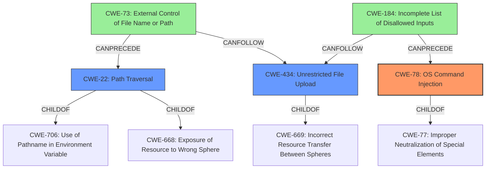

# Raw Analyzer Response for CVE-2024-10019

# Summary
| CWE ID | CWE Name | Confidence | CWE Abstraction Level | CWE Vulnerability Mapping Label | CWE-Vulnerability Mapping Notes |
|---|---|---|---|---|---|
| CWE-78 | Improper Neutralization of Special Elements used in an OS Command ('OS Command Injection') | 0.9 | Base | Allowed | Primary CWE. The application constructs an OS command using external input, but fails to neutralize special elements, leading to OS command injection. |
| CWE-22 | Improper Limitation of a Pathname to a Restricted Directory ('Path Traversal') | 0.8 | Base | Allowed | Secondary CWE. The application does not properly limit the pathname to a restricted directory, enabling path traversal. |
| CWE-434 | Unrestricted Upload of File with Dangerous Type | 0.6 | Base | Allowed | The application allows the upload of a file with a dangerous type (server.py), which can then be executed. |

## Evidence and Confidence

*   **Confidence Score:** 0.8
*   **Evidence Strength:** HIGH

## Relationship Analysis
The vulnerability involves multiple weaknesses that relate to each other:

*   CWE-78 is the primary weakness, representing the OS command injection vulnerability.
*   CWE-22 is a related weakness, as path traversal allows the attacker to place the malicious file in a location where it can be executed.
*   CWE-434 is also a related weakness, as the unrestricted file upload allows the attacker to upload the malicious file in the first place.

The hierarchical relationships are:

*   CWE-78 is a child of CWE-77, which represents improper neutralization of special elements.
*   CWE-22 is a child of CWE-706 and CWE-668.
*   CWE-434 is a child of CWE-669.

The chain relationships show the progression of the vulnerability:

*   CWE-73 (External Control of File Name or Path) can precede CWE-22.
*   CWE-184 (Incomplete List of Disallowed Inputs) can precede CWE-78.
*   CWE-434 can follow CWE-73 and CWE-184.

## Vulnerability Chain
The vulnerability chain starts with the **improper sanitization** of the `app_name` parameter which leads to a **path traversal vulnerability** that allows an attacker to upload a malicious `server.py` file. This, in turn, leads to **OS command injection**, enabling the attacker to execute arbitrary code.

*   **Root Cause:** **Improper sanitization** of the `app_name` parameter.
*   **Weakness 1:** CWE-22 Improper Limitation of a Pathname to a Restricted Directory ('Path Traversal').
*   **Weakness 2:** CWE-434 Unrestricted Upload of File with Dangerous Type.
*   **Weakness 3:** CWE-78 Improper Neutralization of Special Elements used in an OS Command ('OS Command Injection').
*   **Impact:** Execution of arbitrary code.

## Summary of Analysis
The primary weakness is CWE-78, as the core issue is the ability to inject OS commands due to **improper neutralization** of special elements. CWE-22 is a secondary weakness because it allows the attacker to place the malicious file in a location where it can be executed. CWE-434 is also a secondary weakness as it allows the upload of the malicious file in the first place.

The analysis is based on the provided vulnerability description and the keyphrases identified within it. The description explicitly mentions **path traversal** and **OS command injection** due to the function not properly sanitizing the `app_name` parameter. This directly supports the selection of CWE-78 and CWE-22. The ability to upload a malicious file supports the selection of CWE-434.

The graph relationships influenced the final selection by highlighting the potential chains of vulnerabilities. For example, CWE-73 can precede CWE-22 and CWE-434, indicating that external control of the file name or path can lead to path traversal and unrestricted file upload.

The selected CWEs are at the optimal level of specificity because they accurately represent the weaknesses described in the vulnerability description. CWE-78 is a Base level CWE that directly addresses the OS command injection vulnerability. CWE-22 is also a Base level CWE that accurately represents the path traversal vulnerability. CWE-434 is also a Base level CWE that accurately represents the unrestricted file upload vulnerability.