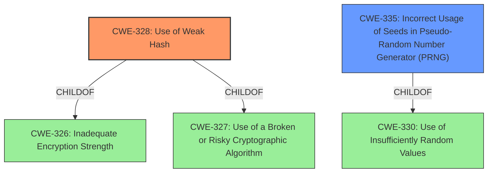

# Analysis for CVE-2024-10026

# Summary
| CWE ID | CWE Name | Confidence | CWE Abstraction Level | CWE Vulnerability Mapping Label | CWE-Vulnerability Mapping Notes |
|---|---|---|---|---|---|
| CWE-328 | Use of Weak Hash | 0.9 | Base | Allowed | Primary CWE. The vulnerability description and reference links clearly point to the use of weak hashing algorithms as a root cause. |
| CWE-335 | Incorrect Usage of Seeds in Pseudo-Random Number Generator (PRNG) | 0.8 | Base | Allowed | Secondary CWE. The vulnerability description mentions small sizes of seeds/secrets, and the reference links discuss improvements to random number generation. |

## Evidence and Confidence

*   **Confidence Score:** 0.85
*   **Evidence Strength:** HIGH

## Relationship Analysis
The primary CWE, CWE-328 [CWE-328: Use of Weak Hash], is a base-level CWE, offering a clear characterization of the use of an insecure hashing algorithm. It is related to CWE-326 [CWE-326: Inadequate Encryption Strength] and CWE-327 [CWE-327: Use of a Broken or Risky Cryptographic Algorithm] as a child.
CWE-335 [CWE-335: Incorrect Usage of Seeds in Pseudo-Random Number Generator (PRNG)] is also a base-level CWE, specifically addressing the incorrect handling of seeds in PRNGs. It is a child of CWE-330 [CWE-330: Use of Insufficiently Random Values].

## Vulnerability Chain
The vulnerability chain starts with the use of **weak hashing algorithms and small sizes of seeds/secrets**. This leads to the ability for a remote attacker to calculate a local IP address and a per-boot identifier, which can then be used to track a device.

## Summary of Analysis
The initial assessment identified the **weak hashing algorithm and small sizes of seeds/secrets** as the root cause of the vulnerability. The retriever results also highlighted CWE-328 [CWE-328: Use of Weak Hash] and CWE-335 [CWE-335: Incorrect Usage of Seeds in Pseudo-Random Number Generator (PRNG)] as potential matches.

The final decision to map to CWE-328 [CWE-328: Use of Weak Hash] and CWE-335 [CWE-335: Incorrect Usage of Seeds in Pseudo-Random Number Generator (PRNG)] is based on the following evidence:

*   The vulnerability description explicitly mentions a **weak hashing algorithm and small sizes of seeds/secrets**.
*   The CVE reference links discuss the replacement of the Jenkins hash function with SHA256 and the use of cryptographically secure RNGs, which directly relate to hashing algorithms and random number generation.
*   The fixes implemented in the reference links address the identified weaknesses by using stronger cryptographic functions and increasing the size of the secret used for hashing.

These CWEs are at the optimal level of specificity because they directly address the root causes of the vulnerability: the use of a weak hashing algorithm and the incorrect handling of seeds in random number generation.

Other CWEs considered but not used:

*   CWE-656 [CWE-656: Reliance on Security Through Obscurity]: While obscurity might be a factor, the primary issue is the use of weak algorithms and seeds, not the reliance on obscurity as the main security mechanism.
*   CWE-330 [CWE-330: Use of Insufficiently Random Values]: This is a class-level CWE, and CWE-335 [CWE-335: Incorrect Usage of Seeds in Pseudo-Random Number Generator (PRNG)] is a more specific base-level CWE that better describes the issue.
*   CWE-327 [CWE-327: Use of a Broken or Risky Cryptographic Algorithm]: While related, CWE-328 [CWE-328: Use of Weak Hash] is more specific to the hashing algorithm issue.
*   CWE-916 [CWE-916: Use of Password Hash With Insufficient Computational Effort]: This is specific to password hashing, which is not the primary focus of the vulnerability.
*   CWE-760 [CWE-760: Use of a One-Way Hash with a Predictable Salt]: While a predictable salt could be a factor, the description focuses on the weak hash algorithm itself.