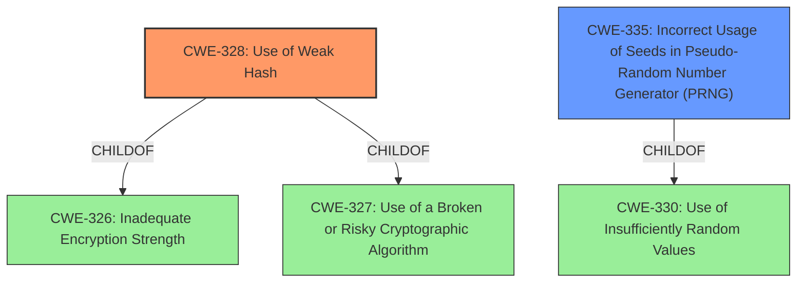

# Analysis Report for CVE-2024-10026

# Vulnerability Analysis Report: CVE-2024-10026

## Description

A **weak hashing algorithm and small sizes of seeds/secrets** in Googles gVisor allowed for a remote attacker to calculate a local IP address and a per-boot identifier that could aid in tracking of a device in certain circumstances.

## Vulnerability Description Key Phrases

- **Rootcause:** weak hashing algorithm and small sizes of seeds/secrets
- **Impact:** calculate a local IP address and a per-boot identifier
- **Attacker:** remote attacker
- **Product:** Googles gVisor

## Analysis (with Relationship Data)

# Summary
| CWE ID | CWE Name | Confidence | CWE Abstraction Level | CWE Vulnerability Mapping Label | CWE-Vulnerability Mapping Notes |
|---|---|---|---|---|---|
| CWE-328 | Use of Weak Hash | 0.9 | Base | Primary | Allowed |
| CWE-335 | Incorrect Usage of Seeds in Pseudo-Random Number Generator (PRNG) | 0.8 | Base | Secondary | Allowed |

## Evidence and Confidence

*   **Confidence Score:** 0.85
*   **Evidence Strength:** HIGH

## Relationship Analysis
The primary CWE, CWE-328, is a base-level weakness that directly reflects the use of a weak hashing algorithm. It is a child of CWE-326 and CWE-327. CWE-335, a secondary CWE, is also a base-level weakness indicating incorrect usage of seeds in PRNG. It is a child of CWE-330. The relationship analysis suggests that the root cause involves multiple contributing factors related to randomness and cryptography.



## Vulnerability Chain
The vulnerability chain starts with the **use of a weak hashing algorithm and small sizes of seeds/secrets**. This leads to the ability to calculate a local IP address and a per-boot identifier, which could aid in tracking a device. The root causes are CWE-328 and CWE-335 and the impact is device tracking.

## Summary of Analysis
The initial analysis identified the **weak hashing algorithm and small sizes of seeds/secrets** as the root cause. The vulnerability description and CVE reference links provide sufficient evidence to support this assessment.

The selection of CWE-328 and CWE-335 is based on the following evidence:

*   The vulnerability description explicitly mentions a "**weak hashing algorithm and small sizes of seeds/secrets**".
*   The CVE reference links confirm the use of weaker algorithms like Jenkins hash and SHA-1 with short seeds, and also highlights the replacement of PRNG with cryptographically secure RNGs.

CWE-328 (Use of Weak Hash) is a base-level CWE that accurately describes the use of a weak hashing algorithm, as indicated in the vulnerability description and CVE reference links. CWE-335 (Incorrect Usage of Seeds in Pseudo-Random Number Generator (PRNG)) is also a base-level CWE that accurately describes the issue of using small sizes of seeds/secrets.

Other CWEs were considered but not selected:

*   CWE-656 (Reliance on Security Through Obscurity): While the use of a weak hash might be considered a form of security through obscurity, the primary issue is the weakness of the algorithm itself, not the reliance on its obscurity.
*   CWE-330 (Use of Insufficiently Random Values): While related to the use of small seeds, CWE-335 is more specific in addressing the incorrect management of seeds in PRNGs.
*   CWE-916 (Use of Password Hash With Insufficient Computational Effort): This CWE is specific to password hashing, which is not the primary focus of the vulnerability.

The selected CWEs are at the optimal level of specificity because they directly address the root causes identified in the vulnerability description and CVE reference links.

Relevant CWE Information:

# Enhanced Context (25 CWEs)
The following CWEs were identified as potentially relevant to this vulnerability:

## CWE-1240: Use of a Cryptographic Primitive with a Risky Implementation
**Abstraction Level**: Base
**Similarity Score**: 0.79
**Source**: dense

**Description**:
To fulfill the need for a cryptographic primitive, the product implements a cryptographic algorithm using a non-standard, unproven, or disallowed/non-compliant cryptographic implementation.

**Mapping Guidance**:
- Usage: Allowed
- Rationale: This CWE entry is at the Base level of abstraction, which is a preferred level of abstraction for mapping to the root causes of vulnerabilities.

## CWE-335: Incorrect Usage of Seeds in Pseudo-Random Number Generator (PRNG)
**Abstraction Level**: Base
**Similarity Score**: 0.79
**Source**: dense

**Description**:
The product uses a Pseudo-Random Number Generator (PRNG) but does not correctly manage seeds.

**Mapping Guidance**:
- Usage: Allowed
- Rationale: This CWE entry is at the Base level of abstraction, which is a preferred level of abstraction for mapping to the root causes of vulnerabilities.

## CWE-330: Use of Insufficiently Random Values
**Abstraction Level**: Class
**Similarity Score**: 0.79
**Source**: dense

**Description**:
The product uses insufficiently random numbers or values in a security context that depends on unpredictable numbers.

**Mapping Guidance**:
- Usage: Discouraged
- Rationale: This CWE entry is a level-1 Class (i.e., a child of a Pillar). It might have lower-level children that would be more appropriate

## CWE-328: Use of Weak Hash
**Abstraction Level**: Base
**Similarity Score**: 0.78
**Source**: dense

**Description**:
The product uses an algorithm that produces a digest (output value) that does not meet security expectations for a hash function that allows an adversary to reasonably determine the original input (preimage attack), find another input that can produce the same hash (2nd preimage attack), or find multiple inputs that evaluate to the same hash (birthday attack).

**Mapping Guidance**:
- Usage: Allowed
- Rationale: This CWE entry is at the Base level of abstraction, which is a preferred level of abstraction for mapping to the root causes of vulnerabilities.

## CWE-1391: Use of Weak Credentials
**Abstraction Level**: Class
**Similarity Score**: 0.78
**Source**: dense

**Description**:
The product uses weak credentials (such as a default key or hard-coded password) that can be calculated, derived, reused, or guessed by an attacker.

**Mapping Guidance**:
- Usage: Allowed-with-Review
- Rationale: This CWE entry is a Class and might have Base-level children that would be more appropriate

## CWE-916: Use of Password Hash With Insufficient Computational Effort
**Abstraction Level**: Base
**Similarity Score**: 0.78
**Source**: dense

**Description**:
The product generates a hash for a password, but it uses a scheme that does not provide a sufficient level of computational effort that would make password cracking attacks infeasible or expensive.

**Mapping Guidance**:
- Usage: Allowed
- Rationale: This CWE entry is at the Base level of abstraction, which is a preferred level of abstraction for mapping to the root causes of vulnerabilities.

## CWE-331: Insufficient Entropy
**Abstraction Level**: Base
**Similarity Score**: 0.76
**Source**: dense

**Description**:
The product uses an algorithm or scheme that produces insufficient entropy, leaving patterns or clusters of values that are more likely to occur than others.

**Mapping Guidance**:
- Usage: Allowed
- Rationale: This CWE entry is at the Base level of abstraction, which is a preferred level of abstraction for mapping to the root causes of vulnerabilities.

## CWE-798: Use of Hard-coded Credentials
**Abstraction Level**: Base
**Similarity Score**: 0.76
**Source**: dense

**Description**:
The product contains hard-coded credentials, such as a password or cryptographic key.

**Mapping Guidance**:
- Usage: Allowed
- Rationale: This CWE entry is at the Base level of abstraction, which is a preferred level of abstraction for mapping to the root causes of vulnerabilities.

## CWE-321: Use of Hard-coded Cryptographic Key
**Abstraction Level**: Variant
**Similarity Score**: 0.75
**Source**: dense

**Description**:
The use of a hard-coded cryptographic key significantly increases the possibility that encrypted data may be recovered.

**Mapping Guidance**:
- Usage: Allowed
- Rationale: This CWE entry is at the Variant level of abstraction, which is a preferred level of abstraction for mapping to the root causes of vulnerabilities.

## CWE-345: Insufficient Verification of Data Authenticity
**Abstraction Level**: Class
**Similarity Score**: 0.75
**Source**: dense

**Description**:
The product does not sufficiently verify the origin or authenticity of data, in a way that causes it to accept invalid data.

**Mapping Guidance**:
- Usage: Discouraged
- Rationale: This CWE entry is a level-1 Class (i.e., a child of a Pillar). It might have lower-level children that would be more appropriate

## CWE-916: Use of Password Hash With Insufficient Computational Effort
**Abstraction Level**: Base
**Similarity Score**: 9130.77
**Source**: sparse

**Description**:
The product generates a hash for a password, but it uses a scheme that does not provide a sufficient level of computational effort that would make password cracking attacks infeasible or expensive.

**Mapping Guidance**:
- Usage: Allowed
- Rationale: This CWE entry is at the Base level of abstraction, which is a preferred level of abstraction for mapping to the root causes of vulnerabilities.

## CWE-335: Incorrect Usage of Seeds in Pseudo-Random Number Generator (PRNG)
**Abstraction Level**: Base
**Similarity Score**: 8646.21
**Source**: sparse

**Description**:
The product uses a Pseudo-Random Number Generator (PRNG) but does not correctly manage seeds.

**Mapping Guidance**:
- Usage: Allowed
- Rationale: This CWE entry is at the Base level of abstraction, which is a preferred level of abstraction for mapping to the root causes of vulnerabilities.

## CWE-328: Use of Weak Hash
**Abstraction Level**: Base
**Similarity Score**: 8558.50
**Source**: sparse

**Description**:
The product uses an algorithm that produces a digest (output value) that does not meet security expectations for a hash function that allows an adversary to reasonably determine the original input (preimage attack), find another input that can produce the same hash (2nd preimage attack), or find multiple inputs that evaluate to the same hash (birthday attack).

**Mapping Guidance**:
- Usage: Allowed
- Rationale: This CWE entry is at the Base level of abstraction, which is a preferred level of abstraction for mapping to the root causes of vulnerabilities.

## CWE-330: Use of Insufficiently Random Values
**Abstraction Level**: Class
**Similarity Score**: 8466.01
**Source**: sparse

**Description**:
The product uses insufficiently random numbers or values in a security context that depends on unpredictable numbers.

**Mapping Guidance**:
- Usage: Discouraged
- Rationale: This CWE entry is a level-1 Class (i.e., a child of a Pillar). It might have lower-level children that would be more appropriate

## CWE-338: Use of Cryptographically Weak Pseudo-Random Number Generator (PRNG)
**Abstraction Level**: Base
**Similarity Score**: 8396.29
**Source**: sparse

**Description**:
The product uses a Pseudo-Random Number Generator (PRNG) in a security context, but the PRNG's algorithm is not cryptographically strong.

**Mapping Guidance**:
- Usage: Allowed
- Rationale: This CWE entry is at the Base level of abstraction, which is a preferred level of abstraction for mapping to the root causes of vulnerabilities.

## CWE-259: Use of Hard-coded Password
**Abstraction Level**: variant
**Similarity Score**: 4.53
**Source**: graph

**Description**:
CWE-259: Use of Hard-coded Password

**Mapping Guidance**:
- Usage: Allowed
- Rationale: This CWE entry is at the Variant level of abstraction, which is a preferred level of abstraction for mapping to the root causes of vulnerabilities.

**Relationships**:
- CANFOLLOW -> CWE-656
- PEEROF -> CWE-257
- PEEROF -> CWE-321
- CHILDOF -> CWE-798
- CHILDOF -> CWE-798

## CWE-472: External Control of Assumed-Immutable Web Parameter
**Abstraction Level**: base
**Similarity Score**: 4.33
**Source**: graph

**Description**:
CWE-472: External Control of Assumed-Immutable Web Parameter

**Mapping Guidance**:
- Usage: Allowed
- Rationale: This CWE entry is at the Base level of abstraction, which is a preferred level of abstraction for mapping to the root causes of vulnerabilities.

**Relationships**:
- CANFOLLOW -> CWE-656
- REQUIREDBY -> CWE-384
- CHILDOF -> CWE-471
- CHILDOF -> CWE-642
- CANPRECEDE -> CWE-472

## CWE-804: Guessable CAPTCHA
**Abstraction Level**: base
**Similarity Score**: 4.33
**Source**: graph

**Description**:
CWE-804: Guessable CAPTCHA

**Mapping Guidance**:
- Usage: Allowed
- Rationale: This CWE entry is at the Base level of abstraction, which is a preferred level of abstraction for mapping to the root causes of vulnerabilities.

**Relationships**:
- CANFOLLOW -> CWE-330
- CHILDOF -> CWE-1390
- CHILDOF -> CWE-863
- PARENTOF -> CWE-804
- CANPRECEDE -> CWE-804

## CWE-603: Use of Client-Side Authentication
**Abstraction Level**: base
**Similarity Score**: 3.64
**Source**: graph

**Description**:
CWE-603: Use of Client-Side Authentication

**Mapping Guidance**:
- Usage: Allowed
- Rationale: This CWE entry is at the Base level of abstraction, which is a preferred level of abstraction for mapping to the root causes of vulnerabilities.

**Relationships**:
- PEEROF -> CWE-656
- PEEROF -> CWE-300
- CHILDOF -> CWE-602
- CHILDOF -> CWE-1390
- PARENTOF -> CWE-603

## CWE-321: Use of Hard-coded Cryptographic Key
**Abstraction Level**: Variant
**Similarity Score**: 3.02
**Source**: graph

**Description**:
The use of a hard-coded cryptographic key significantly increases the possibility that encrypted data may be recovered.

**Mapping Guidance**:
- Usage: Allowed
- Rationale: This CWE entry is at the Variant level of abstraction, which is a preferred level of abstraction for mapping to the root causes of vulnerabilities.

**Relationships**:
- CANFOLLOW -> CWE-656
- CHILDOF -> CWE-798
- CHILDOF -> CWE-798
- CHILDOF -> CWE-798
- PARENTOF -> CWE-321

## CWE-1272: Sensitive Information Uncleared Before Debug/Power State Transition
**Abstraction Level**: base
**Similarity Score**: 2.21
**Source**: graph

**Description**:
CWE-1272: Sensitive Information Uncleared Before Debug/Power State Transition

**Mapping Guidance**:
- Usage: Allowed
- Rationale: This CWE entry is at the Base level of abstraction, which is a preferred level of abstraction for mapping to the root causes of vulnerabilities.

**Relationships**:
- CANPRECEDE -> CWE-200
- CHILDOF -> CWE-226
- PARENTOF -> CWE-1272
- CANFOLLOW -> CWE-1272

## CWE-1291: Public Key Re-Use for Signing both Debug and Production Code
**Abstraction Level**: base
**Similarity Score**: 2.18
**Source**: graph

**Description**:
CWE-1291: Public Key Re-Use for Signing both Debug and Production Code

**Mapping Guidance**:
- Usage: Allowed
- Rationale: This CWE entry is at the Base level of abstraction, which is a preferred level of abstraction for mapping to the root causes of vulnerabilities.

**Relationships**:
- PEEROF -> CWE-321
- CHILDOF -> CWE-693
- PARENTOF -> CWE-1291

## CWE-760: Use of a One-Way Hash with a Predictable Salt
**Abstraction Level**: variant
**Similarity Score**: 2.16
**Source**: graph

**Description**:
CWE-760: Use of a One-Way Hash with a Predictable Salt

**Mapping Guidance**:
- Usage: Allowed
- Rationale: This CWE entry is at the Variant level of abstraction, which is a preferred level of abstraction for mapping to the root causes of vulnerabilities.

**Relationships**:
- CHILDOF -> CWE-916
- PARENTOF -> CWE-760

## CWE-337: Predictable Seed in Pseudo-Random Number Generator (PRNG)
**Abstraction Level**: variant
**Similarity Score**: 2.16
**Source**: graph

**Description**:
CWE-337: Predictable Seed in Pseudo-Random Number Generator (PRNG)

**Mapping Guidance**:
- Usage: Allowed
- Rationale: This CWE entry is at the Variant level of abstraction, which is a preferred level of abstraction for mapping to the root causes of vulnerabilities.

**Relationships**:
- CHILDOF -> CWE-335
- PARENTOF -> CWE


## CWE Relationship Analysis

Current CWEs represent these abstraction levels: .


### Vulnerability Chain Analysis

**Chain starting from CWE-798:**
- 798 (Use of Hard-coded Credentials) - ROOT


**Chain starting from CWE-259:**
- 259 (Use of Hard-coded Password) - ROOT


### CWE Relationship Diagram

```mermaid
graph TD
    classDef primary fill:#f96,stroke:#333,stroke-width:2px
    classDef secondary fill:#69f,stroke:#333
    classDef tertiary fill:#9e9,stroke:#333
```


*Report generated on 2025-07-10 11:11:26*
